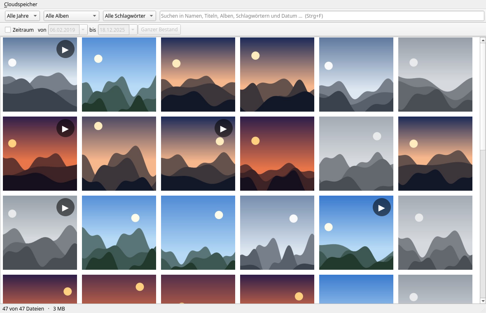

[Deutsch](README.md) | [English](README.en.md) | [Änderungsprotokoll](CHANGELOG.md) | [TODO](TODO.md) | [Anleitungen](docs/README.md)

<p align="center">
  
</p>

# WOLKENErnte

Bilder und Videos aus den Wolken holen – und dort aufräumen.

Fotos liegen heute verstreut: ein Teil bei Google, ein Teil bei Apple, ein Teil
bei Proton, dazu OneDrive, Dropbox und die eigene Nextcloud. WOLKENErnte holt
sie an einen Ort Ihrer Wahl, ordnet sie nach Aufnahmedatum, findet Doppelgänger
– und räumt auf Ihr Wort hin drüben auf, was Sie nicht mehr brauchen.

**Was heute geht:** aus einem Wolkenspeicher ernten und dort aufräumen,
Google-Takeout-Archive einlesen, Bilder aus Ordnern übernehmen, Doppelgänger
finden, verschlagworten, alles durchsehen – wahlweise im Browser oder als
Fensteranwendung. An einer echten Nextcloud erprobt sind Anmelden, Durchsehen,
Holen, Erfassen und der Aufräum-Probelauf. **Noch nicht erprobt ist das scharfe
Löschen** (`--wirklich`); was sonst offen ist, steht in [TODO.md](TODO.md).

[](docs/bilder/README.md)

Mehr davon: [alle Bildschirmfotos](docs/bilder/README.md).

## Was bei welchem Anbieter geht

Diese Tabelle ist der wichtigste Abschnitt dieser Datei. Ausgerechnet die drei
Anbieter, an die man bei Fotos zuerst denkt, sind die schwierigsten.

| Anbieter | sehen | holen | **in der Wolke löschen** |
|---|:---:|:---:|:---:|
| Nextcloud (WebDAV) | ja | ja | **ja** |
| Dropbox | ja | ja | **ja** |
| Microsoft OneDrive | ja | ja | **ja** |
| Google **Drive** | ja | ja | **ja** |
| Box, pCloud | ja | ja | **ja** |
| iCloud **Drive** | ja | ja | **ja** |
| Proton **Drive** | ja | ja | **ja** |
| **iCloud Fotos** | ja | ja | **nein** |
| **Google Fotos** | nein | nein | **nein** |
| **Proton Fotos** | nein | nein | **nein** |

**Google Fotos** ist für fremde Programme seit dem 31. März 2025 verschlossen.
Eine Anwendung sieht dort nur noch die Bilder, die sie selbst hochgeladen hat –
Ihre eigene Mediathek ist unerreichbar. Eine Löschfunktion hat es dort nie
gegeben. Der Weg führt über *Google Takeout*: Sie fordern das Archiv selbst an,
WOLKENErnte wertet es aus. Aufgeräumt wird danach von Hand im Browser.

**iCloud Fotos** lässt sich vollständig ansehen und herunterladen, aber nicht
anfassen – der Zugang ist ausdrücklich nur lesend. Mit eingeschaltetem
*erweitertem Datenschutz* geht dort gar nichts.

**Proton Fotos** liegt in einem eigenen Bereich, den fremde Programme nicht
sehen. Dafür gibt es derzeit keinen Weg – auch keinen umständlichen.

Die Belege zu jeder Aussage stehen in [docs/anbieter.md](docs/anbieter.md), mit
Datum. Diese Lage ändert sich schnell.

## Loslegen

```
wolkenernte ernten   ~/Bilder/Archiv  ~/Downloads/takeout-Ordner
wolkenernte erfassen ~/Bilder/Archiv  ~/Downloads/takeout-Ordner
wolkenernte pruefen  ~/Bilder/Archiv  ~/Downloads/takeout-Ordner
wolkenernte fenster  ~/Bilder/Archiv
```

**Die ZIP-Dateien von Google bleiben gepackt.** Ein Takeout kann hunderte
Gigabyte umfassen; es auszupacken hieße, denselben Bestand zweimal auf der
Platte zu haben – genau dann, wenn der Platz knapp ist. Sie können auf den
Ordner mit den ZIPs zeigen oder auf eine einzelne Datei; die übrigen Teile
desselben Exports holt WOLKENErnte selbst dazu:

```
wolkenernte ernten ~/Bilder/Archiv ~/Downloads/takeout-20260910T084500Z-001.zip
```

**Das ist nicht bloß bequem.** Google zerlegt den Export ohne Rücksicht auf
Zusammengehöriges: Ein Bild liegt im einen Teilarchiv, seine Metadaten im
nächsten. Wer die Teile einzeln einliest, verliert an jeder Nahtstelle
Aufnahmedatum und Ortsangabe – und merkt es nicht, weil die Bilder ja da sind.

**Die Reihenfolge ist keine Geschmackssache.** Erst *ernten* – die Bilder ins
Archiv. Dann *erfassen* – Orte, Titel und Alben in die Datenbank, denn die
stehen nur in den Quellen und wären beim Löschen verloren. Dann *pruefen* – der
Nachweis, dass wirklich jedes Bild angekommen ist. **Und erst danach** darf eine
Quelle gelöscht werden.

Weitere Befehle: `wolkenernte anbieter` zeigt die Tabelle von oben,
`wolkenernte bestand` die Zahlen aus der Datenbank, `wolkenernte doppelt` sucht
ähnliche Bilder, `wolkenernte verschlagworten` vergibt Schlagwörter,
`wolkenernte aufraeumen` räumt in der Wolke auf, `wolkenernte rclone` prüft, ob
der Zugang zu den Wolken bereit ist, und `wolkenernte zugang` verwaltet die
Zugänge.

**Wenn Ihr Archiv mit 0.4.1 oder früher entstanden ist**, steht unter jedem
Bild, dessen Datum aus dem Bild selbst kam, eine um ein bis zwei Stunden zu
späte Uhrzeit – EXIF wurde als UTC gelesen statt als Ortszeit. 0.4.2 hat das
für neue Läufe behoben; ein bestehendes Archiv rechnet dieser Befehl nach:

```
wolkenernte uhrzeit ~/Bilder/Archiv              # nur nachsehen
wolkenernte uhrzeit ~/Bilder/Archiv --wirklich   # und richtigstellen
```

Der erste Aufruf ändert nichts, er zählt nur. Der zweite schreibt ein
Protokoll und lässt sich mit `--zurueck` vollständig aufheben. Bilder, deren
Datum aus einer Takeout-Metadatendatei kam, waren nie betroffen und bleiben
unangetastet.

`wolkenernte neuigkeiten` fragt bei GitHub nach, ob es eine neuere Fassung gibt.
**Das ist der einzige Netzaufruf, den WOLKENErnte von sich aus an einen fremden
Server richtet** – und er geschieht nur, wenn Sie ihn ausdrücklich verlangen.
Kein Aufruf beim Start, keiner im Hintergrund. Übertragen wird nichts als die
Anfrage: kein Archivinhalt, keine Kennung, keine Zählung.

## Das Archiv

```
Archiv/
├── 2023/2023-07/IMG_1234.jpg     nach Aufnahmedatum geordnet
├── ohne-datum/IMG_5678.jpg       wenn keines zu ermitteln war
└── .wolkenernte/
    ├── bestand.db                Orte, Titel, Alben, Favoriten
    └── vorschau/                 Vorschaubilder
```

Nach Datum und nicht nach Alben: Ein Bild kann in mehreren Alben liegen, aber
nur an einer Stelle auf der Platte. Die Albumzugehörigkeit steht in der
Datenbank.

**Ihre Bilder bleiben gewöhnliche Dateien.** Kein eigenes Format, keine
Verschlüsselung, kein Verzeichnisdienst. Wer WOLKENErnte in zehn Jahren nicht
mehr hat, öffnet den Ordner mit jedem beliebigen Programm.

## Zwei Oberflächen

Beide zeigen dasselbe: Bilder in Kacheln, Filter nach Jahr, Album, Schlagwort
und **Zeitraum**, Suche über Dateinamen, Titel und Alben, Einzelansicht mit Ort
und Aufnahmedatum, Videowiedergabe. Sie sitzen auf demselben Fundament; keine
ist ein Ersatz für die andere.

**Der Zeitraum arbeitet mit einem Kalender**: »alles zwischen dem 24. und dem
26. Dezember 2024«, Bilder und Videos gleichermaßen. Beide Enden zählen mit –
wer »bis zum 30. Juni« sagt, meint den ganzen 30. Juni. Bilder ohne bekanntes
Aufnahmedatum bleiben draußen; ihr Zeitstempel ist der Zeitpunkt der Übernahme
und wäre eine falsche Antwort.

**`wolkenernte fenster`** öffnet ein richtiges Fenster. Blättern mit den
Pfeiltasten, zurück mit Escape. Braucht **PySide6** – rund hundert Megabyte.

**`wolkenernte oberflaeche`** startet einen Dienst und öffnet den Browser. Der
kann Bilder und Videos ohnehin anzeigen, es kommt also nichts dazu. **Der Dienst
hört ausschließlich auf 127.0.0.1** und ist von außen nicht erreichbar – er
zeigt private Fotos und hat keine Anmeldung.

Bei 14.767 Bildern steht das Fenster in einer halben Sekunde: Vorschaubilder
werden erst geladen, wenn sie zu sehen sind, und beide Oberflächen teilen sich
den Zwischenspeicher.

## Einrichten

**Arch und Manjaro** – aus dem Quelltext:

```
cd verpacken/arch && makepkg -si
```

Sobald das Paket im AUR steht, geht es einfacher, und Aktualisierungen kommen
dann mit dem Rest des Systems mit (siehe
[verpacken/aur/](verpacken/aur/README.md)):

```
pamac install wolkenernte
```

**Alle anderen** – der Kern läuft mit Python 3.11 aufwärts ohne Fremdpakete:

```
python3 -m wolkenernte oberflaeche ~/Bilder/Archiv
```

Empfohlen, aber nicht nötig:

| Paket | wofür |
|---|---|
| `python-pillow` | Vorschaubilder und Doppelgängersuche |
| `pyside6` | die Fensteranwendung (`wolkenernte fenster`) |
| `rclone` ab 1.75.0 | Zugang zu den Wolkenspeichern |
| `ffmpeg` | Vorschaubilder aus Videos |
| `python-onnxruntime-cpu` | Schlagwörter aus dem Bild |

Ohne Pillow zeigt die Weboberfläche die Originale – langsamer, aber benutzbar.
Ohne PySide6 gibt es nur die Weboberfläche. Ohne ffmpeg tragen Videos ein
Symbol statt eines Standbildes. Ohne onnxruntime bleiben die Schlagwörter bei
dem, was Datum, Dateiname und Bildmaße hergeben.

## Wo die Zugangsdaten liegen

In `~/.config/wolkenernte/rclone.conf`, mit Dateimodus `0600` – **nicht** in der
`rclone.conf`, die Sie vielleicht selbst pflegen. Wer WOLKENErnte loswird, nimmt
diese eine Datei mit, und das Programm kann in Ihren eigenen rclone-Zugängen
nichts anrichten.

**Was dort steht, ist verschleiert, nicht verschlüsselt.** rclone nennt das
`obscure`; `rclone reveal` dreht es in einer Zeile zurück. Wer die Datei lesen
kann, kann die Kennwörter lesen. Eine verschlüsselte Konfiguration
(`rclone config password`) unterstützt WOLKENErnte **noch nicht** – siehe
[TODO.md](TODO.md).

Drei Dinge mildern das:

* **Bei Nextcloud ein App-Passwort**, nicht das Kontokennwort. Es gilt nur für
  dieses Programm und lässt sich einzeln zurückziehen; bei eingeschalteter
  Zwei-Faktor-Anmeldung nimmt Nextcloud das Kontokennwort ohnehin nicht an.
* **Bei Dropbox, OneDrive, Google Drive, Box und pCloud** läuft die Anmeldung
  über OAuth. Ein Kennwort erreicht das Programm dabei nie – nur ein Token, das
  Sie beim Anbieter widerrufen können.
* **Die rclone-Schnittstelle ist abgedichtet.** Sie ist laut rclones eigener
  Doku so mächtig wie ein Shell-Zugriff. Deshalb: nur `127.0.0.1`, Benutzer und
  Kennwort bei jedem Start neu gewürfelt, übergeben über die
  **Prozessumgebung** – die Kommandozeile kann unter Linux jeder in `/proc`
  lesen – und `--rc-no-auth` niemals. Drei Tests nageln das fest.

Und die unbequeme Wahrheit dahinter: Solange Ihr Bildarchiv daneben aus
gewöhnlichen Dateien besteht – und das ist Absicht, siehe oben –, schützt ein
verschlüsselter Zugangsschlüssel wenig. Wer den Rechner hat, hat die Fotos.

## Wie es gebaut ist

Der Kern kommt **ohne Fremdpakete** aus. Den Abruf aus den Wolken übernimmt
[rclone](https://rclone.org/), das als eigener Dienst läuft und über eine
gewöhnliche HTTP-Schnittstelle angesprochen wird – dafür genügen `urllib` und
`json` aus der Standardbibliothek.

Das hat einen Nebeneffekt, der Geld spart: Weil die Zugangsdaten zu Google der
Anwender selbst anlegt, entfällt das jährliche CASA-Sicherheitsaudit, das Google
für weitreichende Zugriffsrechte verlangt – je nach Prüflabor 500 bis 4.500
US-Dollar im Jahr.

## Lizenz

[MIT](LICENSE)
