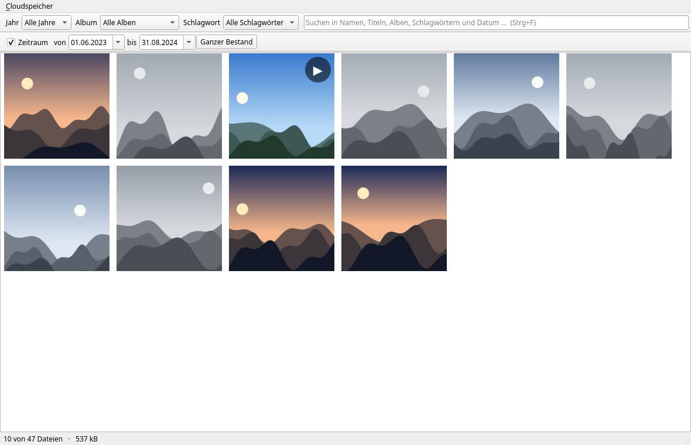
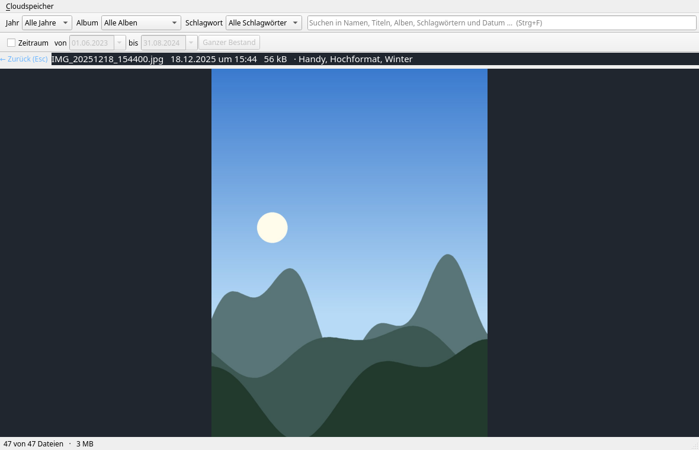
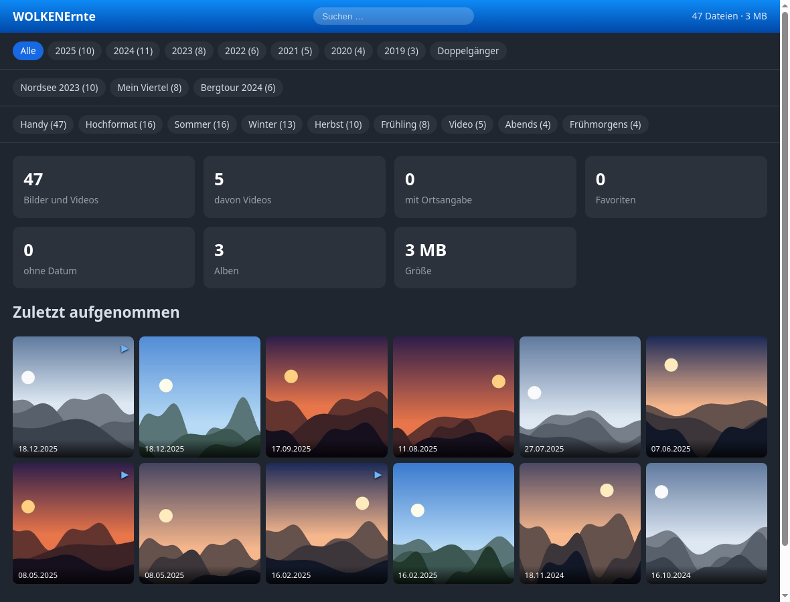
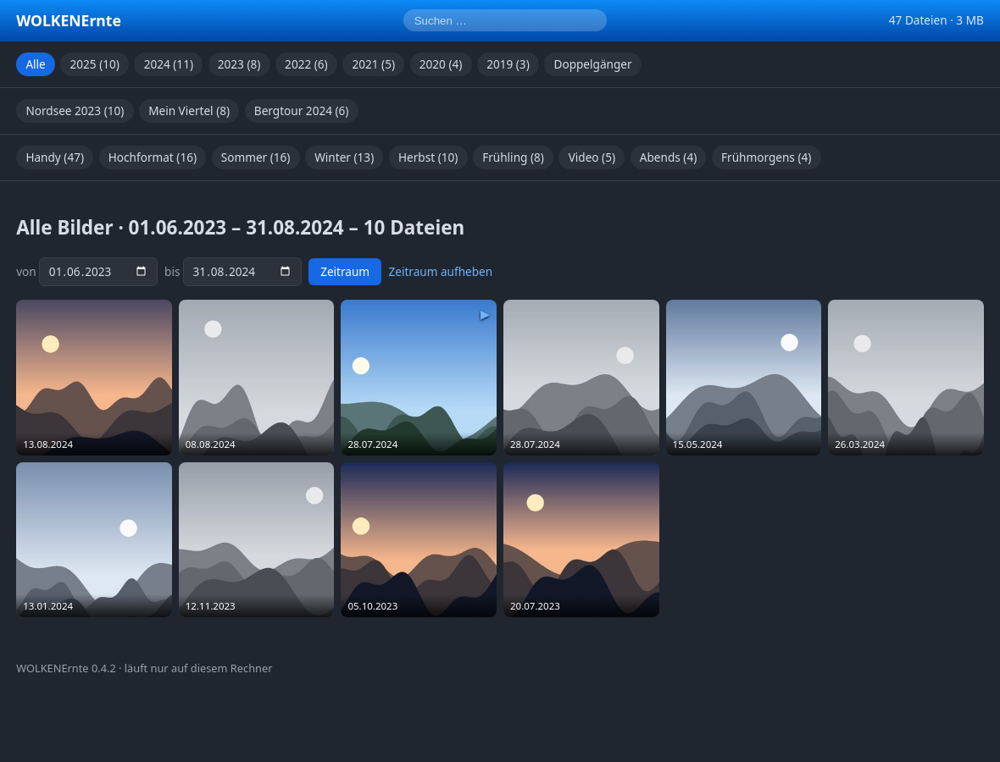

[Übersicht](../../README.md) | [English](../../README.en.md) | [Anleitungen](../README.md)

# Bildschirmfotos

**Alle Bilder auf dieser Seite zeigen ein erfundenes Archiv.** Die Aufnahmen
darin sind gerechnet – ein Farbverlauf, eine Sonne, ein paar Hügelketten –, die
Albumnamen sind Platzhalter. Ein Bildschirmfoto aus einem echten Bestand zeigte
Urlaubsziele, Wohnorte und Gesichter; im Kleinformat kaum lesbar, in der
Bilddatei aber vollständig vorhanden.

**Alles andere darauf ist echt.** Jahreszahlen, Anzahlen, Alben, Schlagwörter
und Dateigrößen hat WOLKENErnte selbst ausgerechnet: Die erfundenen Aufnahmen
laufen durch `ernten`, `erfassen` und `verschlagworten` wie jeder andere
Bestand. Neu erzeugt wird alles mit

```
python3 werkzeuge/bildschirmfotos.py
```

## Die Fensteranwendung

`wolkenernte fenster ~/Bilder/Archiv` – Filter nach Jahr, Album und Schlagwort,
Suche, und das Abspielzeichen auf den Videos.


Der **Zeitraum** mit zwei Kalenderblättern: alles zwischen zwei Tagen, Bilder
und Videos gleichermaßen. Beide Enden zählen mit.



Die Einzelansicht, mit Dateiname, Aufnahmezeitpunkt, Größe und Schlagwörtern in
der Kopfzeile. Blättern mit den Pfeiltasten, zurück mit Escape.



## Die Weboberfläche

`wolkenernte oberflaeche ~/Bilder/Archiv` – derselbe Bestand im Browser, ohne
PySide6. Der Dienst hört ausschließlich auf 127.0.0.1.



Derselbe Zeitraum wie oben, hier mit dem Kalender, den der Browser mitbringt.


